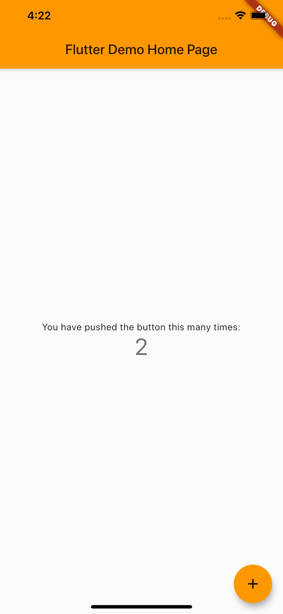

## ko, mac, get start :  Flutter Setting

https://flutter-ko.dev/docs/get-started/install/macos

1. Flutter SDK 다운로드 설치

2. 본인의 flutter설치경로/flutter/bin 경로를 bash_profile에 환경변수로 추가

3. flutter doctor 로 필요 사항들 확인
    [✓] Flutter (Channel stable, v1.12.13+hotfix.5, on Mac OS X 10.15.1 19B88,
        locale ko-KR)
    [✓] Android toolchain - develop for Android devices (Android SDK version 29.0.0)
    [✓] Xcode - develop for iOS and macOS (Xcode 11.2.1)
    [✓] Android Studio (version 3.4)
    [✓] VS Code (version 1.41.0)
    [!] Connected device
        ! No devices available

- 여기서 에러 뜨는 사항들 그대로 수행해주면 됨

4. android studio 개발자 라이센스 등록

5. android studio plugin 설치 (flutter, Dart)

6. 본인의 경우 VS code extension flutter 설치 후  자동 환경 변수 등록

## Flutter test app 생성 & run

- 커멘드라인에서 아래 명령을 실행하여 새로운 Flutter 앱을 만듭니다

1. flutter create my_app
 - Flutter’s starter 앱이 들어있는 my_app 디렉토리가 생성됩니다. 해당 디렉토이동하세요.

2. cd my_app
 -  VS code 의 경우 오른쪽 아래에서 device 를 설정해서 실행해준다.
 - 시뮬레이터에서 앱을 실행하기 위해, 시뮬레이터가 실행중인지 확인한 후 다음을 입력하세요

3. flutter run

## Screen Shot
